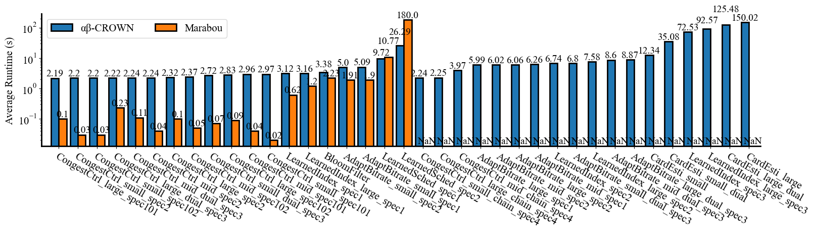
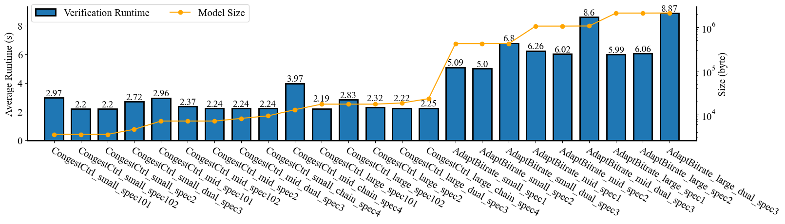

# NN4SysBench: Characterizing Neural Network Verification for Computer Systems
## Introduction
We propose a benchmark suite for neural network verification for systems 
(NN4Sys) in this repository. This suite includes verification 
benchmark for learned index, learned cardinality, learned Internet congestion
control, learned adaptive bitrate, and learned distributed system scheduler, 
which are five tasks that apply neural networks to solve traditional tasks for systems. 


## Quick Start

Steps 1 and 2 reproduce the generation of specifications. All results from these steps are already included in the repository, so you can skip them and go directly to the [Verification](#3-verify) section if you only want to run verification with this benchmark.


### 1. Training the Model

Pre-trained models are available, so you may skip this step if you wish to use them directly.  
However, if you prefer to train the models by yourself, the training code is located in the `/Models` directory.  
We provide scripts for training the following models:

- **Learned Internet Congestion Control**
- **Learned Adaptive Bitrate**
- **Learned Distributed System Scheduler**

You can find the training and testing instructions and pre-trained models for each model in the table below:

| Model                                  | Training and Testing Instructions                                                                 | Pre-trained Model |
|----------------------------------------|----------------------------------------------------------------------------------------------------|------------------|
| Learned Internet Congestion Control     | [Instruction](./Models/Aurora/README.md)               | [Model](./Models/Aurora/gym/results) |
| Learned Adaptive Bitrate               | [Instruction](./Models/Pensieve)               | [Model](./Models/Pensieve/results) |
| Learned Distributed System Scheduler   | [Instruction](./Models/Decima)               | [Model](./Models/Decima/best_models) |
|Database Learned Index|-|[ONNX Model](Models/Learned_index)|
|Learned Bloom Filter|-|[ONNX Model](Models/Bloom_filter/result)|
|Learned Cardinalities|-|[ONNX Model](Models/Cardinality)|


### 2. Generating specifications and ONNX models
This step generates specifications. All results from this step are already included in the repository, so you can skip this step and use them directly.

#### 2.1 Installing dependencies
```bash
conda env create -f environment.yml
```
Then, activate the environment
```bash
conda activate myenv
```

If you have an issue building this environment, please run
```bash
conda create -n myenv python=3.9
conda activate myenv
```
Then, install the missing package.


#### 2.2 generating instance pools
The next step is to generate the "instance pool" for each model, which includes thousands of instances used as resources when generating the benchmark instances.

To generate fixed input files for the models, run:
```bash
cd Models
python gen_upper.py --model {"pensieve", "decima", "lindex", "cardinality", "bloom_filter", "aurora", "all"}
cd ..
```
Here is the model and its name in the parameters.
<a name="model-and-name-table"></a>
|Model|Used Name in Parameter|
|----|---|
|Learned Internet Congestion Control|```aurora```|
|Learned Adaptive Bitrate|```pensieve```|
|Learned Distributed System Scheduler|```decima```|
|Database Learned Index|```lindex```|
|Learned Bloom Filter|```bloom_filter```|
|Learned Cardinalities|```cardinality```|
|All Models|```all```|

Note: currently, we only provide the script for 
- **Learned Internet Congestion Control**
- **Learned Adaptive Bitrate**
- **Learned Distributed System Scheduler**

You can skip this step as these files have already been provided. Refer to this [table](#onnx-and-specifications-table) for more information.

### 2.3 Creating ONNX models
We use ONNX format models for verification. To create ONNX models from trained models, run:
```bash
cd Models
python export.py --model {"pensieve", "decima", "lindex", "cardinality", "bloom_filter", "aurora", "all"}
cd ..
```
You can skip this step as ONNX models are already provided. Refer to this [table](#onnx-and-specifications-table) for more information.

### 2.4 Generating specifications
To create the specifications, run the following commands:

```bash
cd Benchmarks
python generate_properties.py --seed 2024
cd ..
```
The default random seed is 2024. 

By default, this step generates 10 instances for each specification separately. If you want to generate more instances, you can set the --size and --model parameters. The model can be chosen from [model and parameter table](#model-and-name-table)


```bash
cd Benchmarks
python generate_properties.py --model pensieve --size 20
cd ..
```

When you see the message 

```
Successfully generated required instances!
```
it means the instances have been generated successfully. 

The generated files are located in [```Benchmarks/vnnlib```](./Benchmarks/vnnlib) and [```Benchmarks/marabou_txt```](Benchmarks/marabou_txt).

You can skip this step as instances are provided, you can refer to the [table](#onnx-and-specifications-table) below..

<a name="onnx-and-specifications-table"></a>

| Model | Training and Testing Instructions | ONNX Model |  Instance VNNLIB |  Instance txt   |
|----------------------------------------|----------------------------------------------------------------------------------------------------|------------------------------------------------------------------------------------------------|----------------------------------------------------------------------------------------------------------|--------------------------------------------------------------------------------------------------------|
| Learned Internet Congestion Control     | [Instance Pool](https://github.com/shuyilinn/NN4Sys_Benchmark/tree/main/Benchmarks/src/aurora/aurora_resources) | [ONNX Model](https://github.com/shuyilinn/NN4Sys_Benchmark/tree/main/Benchmarks/onnx)           | [VNNLIB](https://github.com/shuyilinn/NN4Sys_Benchmark/tree/main/Benchmarks/vnnlib)                       | [TXT](https://github.com/shuyilinn/NN4Sys_Benchmark/tree/main/Benchmarks/marabou_txt)                   |
| Learned Adaptive Bitrate               | [Instance Pool](https://github.com/shuyilinn/NN4Sys_Benchmark/tree/main/Benchmarks/src/pensieve/pensieve_resources) | [ONNX Model](https://github.com/shuyilinn/NN4Sys_Benchmark/tree/main/Benchmarks/onnx)           | [VNNLIB](https://github.com/shuyilinn/NN4Sys_Benchmark/tree/main/Benchmarks/vnnlib)                       | [TXT](https://github.com/shuyilinn/NN4Sys_Benchmark/tree/main/Benchmarks/marabou_txt)                   |
| Learned Distributed System Scheduler   | [Instance Pool](https://github.com/shuyilinn/NN4Sys_Benchmark/tree/main/Benchmarks/src/decima/decima_resources) | [ONNX Model](https://github.com/shuyilinn/NN4Sys_Benchmark/tree/main/Benchmarks/onnx)           | [VNNLIB](https://github.com/shuyilinn/NN4Sys_Benchmark/tree/main/Benchmarks/vnnlib)                       | [TXT](https://github.com/shuyilinn/NN4Sys_Benchmark/tree/main/Benchmarks/marabou_txt)                   |
| Database Learned Index                 | [Instance Pool](https://github.com/shuyilinn/NN4Sys_Benchmark/tree/main/Benchmarks/src)            | [ONNX Model](https://github.com/shuyilinn/NN4Sys_Benchmark/tree/main/Benchmarks/onnx)           | [VNNLIB](https://github.com/shuyilinn/NN4Sys_Benchmark/tree/main/Benchmarks/vnnlib)                       | [TXT](https://github.com/shuyilinn/NN4Sys_Benchmark/tree/main/Benchmarks/marabou_txt)                   |
| Learned Bloom Filter                   | [Instance Pool](https://github.com/shuyilinn/NN4Sys_Benchmark/tree/main/Benchmarks/src/bloom_filter/bloom_filter_resources) | [ONNX Model](https://github.com/shuyilinn/NN4Sys_Benchmark/tree/main/Benchmarks/onnx)           | [VNNLIB](https://github.com/shuyilinn/NN4Sys_Benchmark/tree/main/Benchmarks/vnnlib)                       | [TXT](https://github.com/shuyilinn/NN4Sys_Benchmark/tree/main/Benchmarks/marabou_txt)                   |
| Learned Cardinalities                  | [Instance Pool](https://github.com/shuyilinn/NN4Sys_Benchmark/tree/main/Benchmarks/src/mscn/mscn_resources) | [ONNX Model](https://github.com/shuyilinn/NN4Sys_Benchmark/tree/main/Benchmarks/onnx)           | [VNNLIB](https://github.com/shuyilinn/NN4Sys_Benchmark/tree/main/Benchmarks/vnnlib)                       | [TXT](https://github.com/shuyilinn/NN4Sys_Benchmark/tree/main/Benchmarks/marabou_txt)                   |


### 3. Verification

Currently, we provide scripts for [Alpha-Beta-CROWN](https://github.com/Verified-Intelligence/alpha-beta-CROWN) and [Marabou](https://github.com/NeuralNetworkVerification/Marabou/tree/master). We are actively developing this project, and more verifiers will be supported in the future.

#### 3.1 Verification with Alpha-Beta-CROWN

Install Alpha-Beta-CROWN by following the instructions at [https://github.com/Verified-Intelligence/alpha-beta-CROWN](https://github.com/Verified-Intelligence/alpha-beta-CROWN).

Then run:

```bash
cd Verification
python abcrown_run.py --path {path to abcrown.py} --model {pensieve, decima, lindex, cardinality, bloom_filter, aurora, all}
cd ..
```
Hint: the abcrown path is usually like ```/home/User/Verifier_Development/complete_verifier/abcrown.py```

Once the process is complete, you should see the following messages:
```bash
[Done] Finished running abcrown verification for {model}
```


### 3.2 Verification with Marabou
Install Marabou by following the instructions at https://github.com/NeuralNetworkVerification/Marabou/tree/master.

Then run:
```bash
cd Verification
python marabou_run.py --path {runMarabou.py path} --model {"pensieve", "decima", "lindex", "bloom_filter", "aurora", "all"}
cd ..
```

Once the process is complete, you should see the following messages:
```bash
[Done] Finished running marabou verification for {model}
```


### 4. Results Visualization
To visualize the results, run:
```bash
cd Verification/figures
python create_json.py
python draw.py
cd ../..
```

Once the process is complete, you should see the following messages:
```bash
[Done] Creation is finished. Result stored in eval_results.json
[Done] Successfully generated verification_runtime.pdf
[Done] Successfully generated verification_runtime_and_model_size.pdf
```
The generated PDF files will be located in the `/Verification/figures/` directory.
The result would look like the following:






## Build Your Own Benchmark (Simple Example)

### Setup the Environment

Ensure you have the required environment set up. Refer to [Section 2.1](#21-install-dependencies) for detailed instructions.
Run the following commands to install additional required packages for customizing benchmarks:
```bash
cd Customize
pip install -r requirements.txt
cd ..
```

### Step 1: Train and Save Your Model

Train your model using your preferred framework and methodology. Once trained, save the following files to the specified locations:

- **Model Checkpoint**: Save the `.pth` file to `/Customize/model.pt`
- **Model Architecture**: Save the model definition script (e.g., `.py` file) to `/Customize/model.py`

These files will be used to load and evaluate your model.


### Step 2: Configure and Run the Benchmark

We currently support a simple benchmarking setup. To get started:

1. **Edit the Configuration File**: Fill in the details in the provided [configuration file](./Customize/configuration.yml). This file allows you to specify instance parameters and paths for benchmarking.
   
2. **Run the Benchmark**: Once configured, start the benchmark by running:

   ```bash
   python customize.py
   ```
Note: At present, only models with a single output are supported. Models requiring multiple outputs, such as Pensieve, are not yet compatible with this setup.

The benchmarking results will display in the terminal upon completion.


